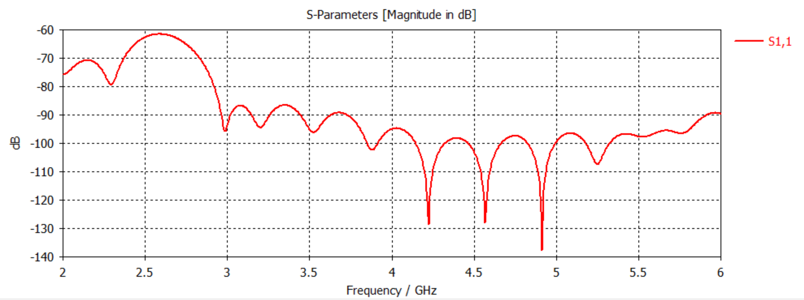
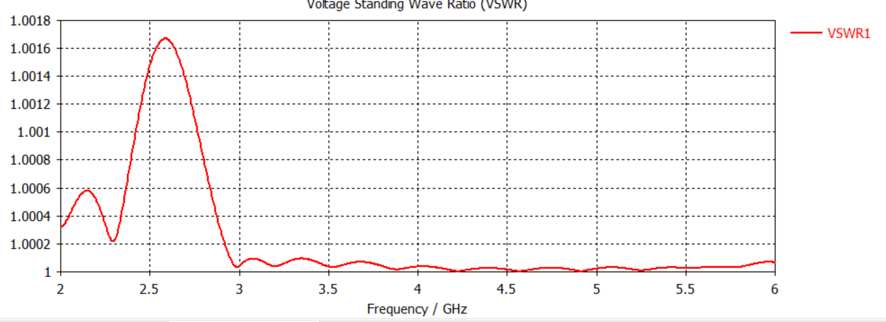

# Rectangular Waveguide Design & S-Parameter Analysis

A rectangular waveguide designed and simulated in **CST Studio Suite** operating in the dominant **$\text{TE}_{10}$ mode**.

---

## 📐 Design Specifications

- **Broad wall ($a$):** $30.083\text{ mm}$
- **Narrow wall ($b$):** $15.5415\text{ mm}$
- **Length ($L$):** $50.0\text{ mm}$
- **Dominant Mode:** $\text{TE}_{10}$
- **Theoretical Cutoff Frequency ($f_c$):**
  $$f_c = \frac{c}{2a} \approx 4.99\text{ GHz}$$

---

## 📊 Simulation & Results (2–6 GHz)

The design was simulated across the $2\text{ GHz} - 6\text{ GHz}$ band in CST Studio Suite to characterize transmission and reflection characteristics.

### 1. $S_{11}$ Return Loss (dB)
Across the sweep, the reflection response exhibits mode propagation behavior with cutoff around $4.99\text{ GHz}$.

### 2. Voltage Standing Wave Ratio (VSWR)
The VSWR closely mirrors the matched transmission band and rises near the lower cutoff threshold.

---

## 📁 Repository Structure

- `rectangular_waveguide.cst` : CST Studio Suite 3D simulation model file
- `s11_plot.png` : S11 Magnitude (dB) vs. Frequency response
- `vswr_plot.png` : Voltage Standing Wave Ratio vs. Frequency
- `README.md` : Project documentation and design analysis

---
**Tool:** CST Studio Suite  
**Author:** Bollam Rakesh Balaji (NIT Mizoram)